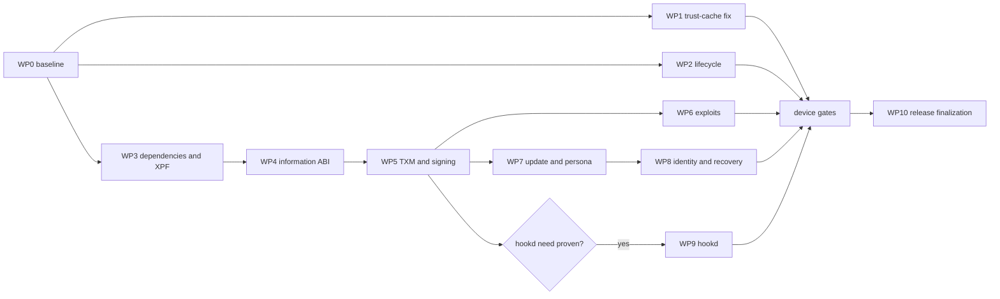

# Dopamine 3 to Opamine RootHide Implementation Report

- Date: 2026-09-14
- Target: Opamine `rhinject` at `1b40dbdb17ff60e106d91ce87c0da249923aa31f`
- Canonical upstream: Dopamine 3.0.9
- RootHide compatibility baseline: Dopamine2-roothide `v2.4.9.x`
- Status: host implementation integrated; device and publication gates remain open

## Scope

Port the beneficial, security-relevant, and lifecycle-relevant changes from
[Dopamine 3.0.9](https://github.com/opa334/Dopamine/releases/tag/3.0.9) into the
current RootHide-derived Opamine architecture without replacing its policy,
randomized jailbreak-root, package, or concealment behavior.

This is a selective forward port, not a merge of Relaxin and not a conversion
back to stock Dopamine. The authority order is:

1. Current Opamine behavior and invariants.
2. RootHide `v2.4.9.x` compatibility behavior.
3. Official Dopamine 3.0.9 implementation and history.
4. Relaxin as secondary evidence for RootHide compatibility gaps.
5. The w2599 repository and binary-only additions as provenance and behavioral
   clues only.

## Executive finding

Dopamine 3 should be ported by subsystem and dependency order. A direct merge
would mix three incompatible assumptions: stock `/var/jb`, RootHide's randomized
root and trust policy, and Opamine's blacklist/allowlist/hidden-tweak model.

The highest-priority defect is independent of the larger migration. The current
same-size trust-cache replacement path writes the full allocation length after
the header rather than the remaining payload length. Official Dopamine corrected
this in commit [`45bfd49`](https://github.com/opa334/Dopamine/commit/45bfd49).
That repair should be implemented and validated first.

## Evidence

### Four-way change classification

The official Dopamine 2.4.9 to 3.0.9 path set was classified against the
RootHide baseline and current Opamine tree:

| Classification | Paths |
| --- | ---: |
| Total changed upstream paths | 257 |
| New in Dopamine 3 | 107 |
| Clean official-base paths | 77 |
| RootHide-modified paths | 52 |
| Opamine-modified paths | 18 |
| New-path collisions | 2 |
| Already identical | 1 |

The 70 RootHide/Opamine-modified or colliding paths are manual-integration
zones. They must not be accepted through an unreviewed tree merge.

### Official changes that drive the migration

| Area | Official commits | Porting consequence |
| --- | --- | --- |
| SPTM/TXM/Corellium foundation | [`909ae9e`](https://github.com/opa334/Dopamine/commit/909ae9e26ffbc64e634b5fb8a5fb516be0154da6) | Establishes the new kernel/ABI foundation; port in smaller reviewed units. |
| TXM trust-cache append | [`123eef3`](https://github.com/opa334/Dopamine/commit/123eef3) | Required for the SPTM/TXM signing path. |
| Trust-cache bounds repair | [`45bfd49`](https://github.com/opa334/Dopamine/commit/45bfd49) | Immediate safety fix; do not defer behind the migration. |
| Patched dyld recovery | [`bb2d582`](https://github.com/opa334/Dopamine/commit/bb2d582) | Port transactional recovery while preserving randomized paths. |
| Application identifier | [`1d43854`](https://github.com/opa334/Dopamine/commit/1d43854) | Review identity migration without changing Opamine package identity accidentally. |
| Lifecycle cleanup | [`2de6939`](https://github.com/opa334/Dopamine/commit/2de6939), [`dccef11`](https://github.com/opa334/Dopamine/commit/dccef11) | Port early to reduce stale state before deeper ABI work. |
| 2.x to 3.x transition | [`3c61bce`](https://github.com/opa334/Dopamine/commit/3c61bce) | Preserve safe reboot/migration behavior but translate all path assumptions. |
| TXM signatures/libraries | [`e632f52`](https://github.com/opa334/Dopamine/commit/e632f52), [`806d08e`](https://github.com/opa334/Dopamine/commit/806d08e), [`b1e664c`](https://github.com/opa334/Dopamine/commit/b1e664c) | Treat signatures, libraries, XPF sets, and primitives as one compatibility unit. |
| Retire `kalloc_pt` | [`1ecbc8a`](https://github.com/opa334/Dopamine/commit/1ecbc8a) | Remove only after all RootHide users and fallback paths are mapped. |
| Disable arm64 kcall on iOS 16+ | [`26374dd`](https://github.com/opa334/Dopamine/commit/26374dd) | Port with explicit version and architecture tests. |
| Jailbreak update path | [`275e2db`](https://github.com/opa334/Dopamine/commit/275e2db) | Reconcile with randomized-root and package-version ownership. |
| Persona/ucred | [`07feb6c`](https://github.com/opa334/Dopamine/commit/07feb6c), [`48c520d`](https://github.com/opa334/Dopamine/commit/48c520d) | Port as a paired lifecycle change and test credential restoration. |
| Root helper completion | [`afb4ac9`](https://github.com/opa334/Dopamine/commit/afb4ac9), [`e5f1692`](https://github.com/opa334/Dopamine/commit/e5f1692) | Preserve exit/wait correctness and eliminate zombies or false success. |

The final 3.0.9 state is the source of truth. Earlier 3.0 releases contain
trust-cache lifecycle problems subsequently corrected upstream.

### Submodule state

| Component | Current Opamine | Dopamine 3 | Decision |
| --- | --- | --- | --- |
| ChOma | `b1a4f2d` | `7dccded` | Current is an ancestor; advance with host tests. |
| litehook | `95863e1` | `0d9d17a` | Current is an ancestor; advance with systemhook tests. |
| opainject | `849bb296` | `849bb296` | Already aligned. |
| XPF | RootHide `3fb4bb3` | Dopamine 3 `9e12b8f` | Histories diverged; manually integrate, never replace wholesale. |

The XPF integration must retain RootHide's `namecache` metrics, `amfi_oids`,
`launch_env_logging`, `developer_mode_status`, set definitions, and exported
headers while adopting the Dopamine 3 patch-level XNU/SPTM/TXM work.

## Non-negotiable Opamine invariants

- Randomized primary and secondary jailbreak roots remain authoritative.
- The jbrand/checksum/symlink contract and cdhash randomization remain intact.
- `randomizeAndLoadBasebinTrustcache` remains the basebin trust-cache path; do
  not reintroduce a static `basebin.tc` assumption.
- Blacklist, allowlist, hidden injection, selected tweaks, and caller-sensitive
  hiding remain one coherent policy system.
- RootHide jbserver domains and package ownership remain authoritative.
- Opamine's RootHide Core and Sileo version pins remain above repository builds;
  Sileo's URL schemes remain stripped from `Info.plist`.
- arm64 and arm64e, including iOS 15 fallback behavior, remain supported.
- `/var/jb` is a compatibility seam, not the internal source of truth.
- A stock Dopamine change may not silently widen supported devices or exploits.

## Explicitly rejected designs

- Do not import Relaxin's large no-kcall/task framework or repository-injection
  machinery.
- Do not reimplement Relaxin's unique-ID job cache or basebin dependency work;
  equivalent RootHide changes are already present in the current baseline.
- Do not adopt w2599's substring/basename-only whitelist model.
- Do not recursively apply mode `0644` to the RootHide preference tree.
- Do not add HelloMnt's generic privileged mount UI, persistent root daemon,
  or watchdogd injection. See the
  [companion HelloMnt report](2026-09-14-hellomnt-static-reverse-engineering-report.md).

## Independent review

After the initial comparison, an independent high-reasoning architecture review
confirmed the need for patch-level XNU comparison, paired persona/ucred work,
dynamic XPF-set preservation, explicit stale-exploit-preference handling,
careful application-identity migration, and product-gating hookd. Those points
are incorporated into WP3, WP6, WP7, WP8, and WP9 rather than maintained as a
separate alternative plan.

## Implementation work packages

### WP0 — Baseline and preservation manifest

Owner profile: Luna Max, mechanical inventory only.

1. Record exact refs, submodule SHAs, package versions, entitlements, and build
   toolchain.
2. Produce a machine-readable list of RootHide/Opamine-owned files and symbols.
3. Add characterization tests for randomized roots, policy modes, Sileo URL
   scheme absence, package pins, and trust-cache generation.
4. Stop if an expected baseline cannot be reproduced.

Exit: clean host characterization and an approved preservation manifest.

### WP1 — Trust-cache out-of-bounds repair

Owner profile: Luna Max following an exact patch specification; Sol review.

1. In the same-size replacement path, write only the bytes remaining after the
   trust-cache header.
2. Add boundary tests for zero entries, one entry, same-size replacement,
   grow/shrink, and malformed lengths.
3. Verify no allocation or write crosses the trust-cache object's declared
   extent.

Exit: focused tests, sanitizable host harness where practical, diff review.

### WP2 — Lifecycle and process cleanup

Owner profile: Luna Max per commit-sized unit.

Port root-helper exit/wait fixes, cleanup changes, 2.x-to-3.x transition logic,
and dyld.old recovery. Translate every `/var/jb` or package assumption through
RootHide path and ownership APIs.

Exit: repeat jailbreak/update/remove simulations are idempotent; no stale helper
or dyld state.

### WP3 — ChOma, litehook, and XPF foundation

Owner profile: Terra or Sol for XPF; Luna Max for pinned submodule advances.

1. Advance ChOma and litehook independently with their dependent host tests.
2. Create an XPF integration branch from the RootHide fork.
3. Replay Dopamine 3 changes by functional cluster.
4. Reapply and test all RootHide metrics, sets, and headers.
5. Compare supported XNU build ranges at patch level, not only major iOS level.

Exit: XPF emits every RootHide and Dopamine 3 value required by the next ABI;
unknown kernels fail closed.

### WP4 — libjailbreak information ABI and primitives

Owner profile: Terra, with Sol API review.

Port the information ABI, translations, inline service primitives, physical
read/write changes, and the post-Dopamine-2 primitive retirement. Maintain a
compatibility table by architecture and OS range.

Exit: old and new consumers agree on structure sizes, capability flags, and
unsupported-operation behavior.

### WP5 — TXM/SPTM trust and signing path

Owner profile: Terra; Sol owns integration.

Port TXM libraries, signatures, trust-cache append behavior, and signing changes
as one transactional subsystem. Keep RootHide's randomized basebin trust-cache
flow and add rollback for partial append/sign failures.

Exit: repeated append, replacement, userspace reboot, and update tests show no
corruption, duplication, or stale trust.

### WP6 — Exploit enablement

Owner profile: Terra per exploit family.

Start with DarkSword metadata compatibility and safety. Add ClearSword, Titan,
momentarius, and clock_alarm only after their XPF/primitives dependencies pass.
Do not advertise support until the exact hardware/OS matrix is device-tested.

Exit: exploit selection is deterministic, stale preferences are rejected, and
each advertised cell has a successful cold/retry/reboot run.

### WP7 — jbctl, update, persona, and credentials

Owner profile: Terra.

Port jailbreak update, persona, ucred, and helper-completion changes together.
Audit error propagation and ensure credentials are restored on every exit path.

Exit: update and failure injection tests leave one valid randomized root and no
borrowed credential state.

### WP8 — App identity and randomized-root recovery

Owner profile: Luna Max for UI wiring, Terra for migration semantics.

Port app-identifier and corrupted-state recovery changes while preserving the
Opamine bundle/package identity. Test both primary and secondary randomized-root
discovery, absent/broken symlinks, and prior RootHide installations.

Exit: recovery never selects or deletes an unrelated root.

### WP9 — Optional hookd integration

Owner profile: Sol product decision, then Terra implementation.

Treat Dopamine 3 hookd as optional infrastructure for demonstrated iOS 26,
Frida, or ElleKit requirements. Integrate beneath the current systemhook policy
and never let it become a second hiding/allowlist authority.

Exit: a written need exists; disabled builds behave identically to current
Opamine; enabled builds pass policy and lifecycle tests.

### WP10 — UI, removal, and package finalization

Owner profile: Luna Max, after all device gates.

Port user-visible support information and removal fixes, reconcile RootHide Core
and Sileo package pins, preserve stripped Sileo URL schemes, and update release
notes.

Exit: clean install/update/remove on each supported OS family and authoritative
CI artifacts.

## Dependency path



WP0, WP1, WP2, and the inventory portion of WP3 may run in parallel. WP4 through
WP8 are dependency ordered. WP9 is product-gated, not automatically included.

## Required host verification

For every work package:

```sh
git diff --check
git submodule status --recursive
```

Then run the narrowest component tests and rebuild the affected artifacts from
clean state. At integration milestones, build every arm64/arm64e component,
inspect slices and entitlements, validate package contents and versions, and
confirm that Sileo has no URL-scheme declarations.

No host-only result may be reported as device support.

## Device matrix and release gates

At minimum, cover:

- arm64 and arm64e;
- iOS 15 legacy fallback;
- iOS 16 PPL-era paths;
- every SPTM/TXM range intended for release;
- a clean installation, an existing RootHide upgrade, a prior Opamine upgrade,
  userspace reboot, full reboot, jailbreak retry, jbupdate, hide/unhide, and
  removal;
- blacklist, allowlist, hidden injection, selected-tweak mode, and selected
  tweak dependency failures;
- randomized primary/secondary roots and broken-root recovery;
- RootHide Core/Sileo upgrade suppression and stripped Sileo URL schemes.

Release requires one reproducible CI artifact, package inspection, and bounded
device observation. A successful compile is not a release gate.

## Implementation handoff rules

Each lower-reasoning worker receives exactly one work package, an owned file
list, the required upstream commits, invariants, tests, and stop conditions.
Workers do not choose architecture or broaden scope. They must not revert other
workers' edits. Sol reviews every manual integration zone and owns final merge,
device-support claims, versioning, and publication.

## Implementation result

The bounded host-side migration has now been implemented on the `rhinject`
worktree. The result includes:

- the corrected same-size trust-cache write plus malformed, boundary, rollback,
  and duplicate-suppression contracts;
- the Dopamine 3 information/primitives ABI, arm64/arm64e slices, SPTM/TXM image
  plumbing, TXM append/signing support, and fail-closed capability gates;
- a RootHide-preserving XPF integration with resettable namecache/AMFI metrics,
  complete teardown, and retry-safe session state;
- bounded DarkSword contiguous-mapping preflight, deterministic exploit
  selection, helper completion, persona/ucred cleanup, and 2.x-to-3.x reboot
  transition handling;
- transactional randomized-root discovery, repair, re-randomization, removal,
  and app-identity recovery that rejects foreign or ambiguous roots;
- post-mutation AMFI OID list verification and rollback;
- package/UI contracts preserving Opamine identity, RootHide Core/Sileo pins,
  all injection-policy modes, and the stripped Sileo URL registration; and
- release version `3.0.9.1`, which sorts after official Dopamine 3.0.9.

The iOS 26+ TXM code-region allocator remains deliberately unavailable because
the complete hookd/provider policy unit was not adopted. ClearSword, Titan, and
momentarius are likewise not advertised without their full dependencies and
device matrix. Host tests and compilation do not replace the device and CI
gates listed below.

### Host verification result

The integrated tree passed a clean `make full` with Xcode 16.4 / iPhoneOS SDK
18.5, producing `BaseBin/basebin.tar`, `Application/Dopamine.ipa`, and
`Application/Dopamine.tipa`. The application reports version `3.0.9.1` and the
unchanged bundle identifier `com.opa334.Dopamine-roothide`; libjailbreak, XPF,
launchdhook, and jbctl contain both arm64 and arm64e slices.

All app lifecycle/exploit/recovery/package contracts, libjailbreak
trust-cache/ABI/TXM contracts, XPF contracts, the RootHide-aware launchd signing
adapter, and the 49-test systemhook characterization suite pass. The release
baseline verifier also passes and confirms that Sileo has no URL-registration
keys. Its one documented systemhook gap remains the bounded native fallback for
unprovable two-level `RTLD_SELF`/`RTLD_NEXT` caller-relative semantics.

The parent repository is not yet independently fetchable because XPF commit
`1e5da55fc6d8221e90b18659d44564acb12f903c` currently exists only in the local
RootHide XPF checkout. A public fork/branch must contain that commit before the
parent gitlink can be pushed as a reproducible build.

## Timeline

1. Phase A: WP0, WP1, WP2, and dependency inventory.
2. Phase B: WP3 and WP4.
3. Phase C: WP5, then WP6 and WP7.
4. Phase D: WP8 and the hookd decision.
5. Phase E: device matrix, WP10, CI artifact, and release review.

The timeline is dependency-based. No calendar estimate is asserted until WP0
establishes reproducible build and device capacity.
